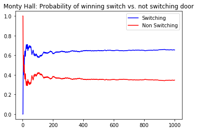

# The Monty Hall Problem

## Introduction

The Monty Hall problem is a famous little puzzle from a game show. It goes like this: you are presented with 3 doors. Behind two are goats and behind the third is a car. You are asked to select a door; if you select the door with the car, you win! After selecting, the host then opens one of the remaining two doors, revealing a goat. The host then asks if you would like to switch doors or stick with your original choice. What would you do? Does it matter?


## Objectives

In this lab you will:

- Use Bayes' theorem along with a simulation to solve the Monty Hall problem

## Run a simulation

This is not a traditional application of Bayes' theorem, so trying to formulate the problem as such is tricky at best. That said, the scenario does capture the motivating conception behind Bayesian statistics: updating our beliefs in the face of additional evidence. With this, you'll employ another frequently used tool Bayesians frequently employ, running simulations. To do this, generate a random integer between one and three to represent the door hiding the car. Then, generate a second integer between one and three representing the player's selection. Then, of those the contestant did not choose, select a door concealing a goat to reveal. Record the results of the simulated game if they changed versus if they did not. Repeat this process a thousand (or more) times. Finally, plot the results of your simulation as a line graph. The x-axis should be the number of simulations, and the y-axis should be the probability of winning. (There should be two lines on the graph, one for switching doors, and the other for keeping the original selection.)


```python
import numpy as np
np.random.seed(82)
```


```python
# Your code here
doors = [1,2,3]
switch = []
no_switch = []
for i in range(1000):
    car_door = np.random.choice(doors, 1)[0]
    selection = np.random.choice(doors, 1)[0]
    if car_door == selection:
        no_switch.append(1)
        switch.append(0)
    goat_door = [n for n in doors if n != car_door and n != selection]
    shown_door = np.random.choice(goat_door,1)
    #choose the non-shown door of goat door
    switch_selection = [n for n in doors if n != shown_door and n != selection]
    #check if you win (compare non-shown/switched door with car door assignemnt
    if  car_door == switch_selection:
        switch.append(1)
        no_switch.append(0)
```


```python
y_switch = [(sum(switch[:i]) / i) for i in range(1, len(switch)+1)]
y_non_switch  = [(sum(no_switch[:i])/i) for i in range(1, len(no_switch)+1)]
x = list(range(1,1001))
```


```python
import matplotlib.pyplot as plt
```


```python
plt.plot(x, y_switch, c='blue', label='Switching')
plt.plot(x, y_non_switch, c='red', label='Non Switching')
plt.title("Monty Hall: Probability of winning switch vs. not switching door")
plt.legend()
plt.show();
```





## Summary

In this lab, you further investigated the idea of Bayes' theorem and Bayesian statistics in general through the Monty Hall problem. Hopefully, this was an entertaining little experience! 
